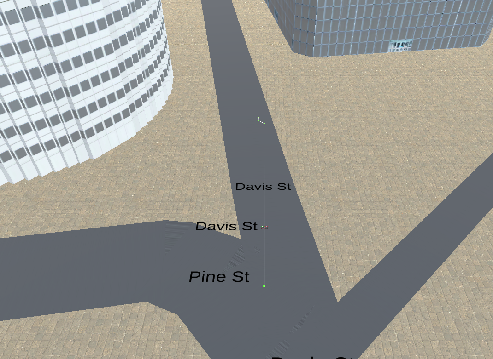

## Project: 3D Motion Planning


---

## [Rubric](https://review.udacity.com/#!/rubrics/1534/view) Points
### Here I will consider the rubric points individually and describe how I addressed each point in my implementation.  

---
### Writeup / README

#### 1. Provide a Writeup / README that includes all the rubric points and how you addressed each one.  You can submit your writeup as markdown or pdf.  

You're reading it! Below I describe how I addressed each rubric point and where in my code each point is handled.

### Explain the Starter Code

#### 1. Explain the functionality of what's provided in `motion_planning.py` and `planning_utils.py`
Given files have a basic planning implementation that entails following steps     
1. Loading the 2.5D map in the colliders.csv file describing the environment with details of buildings as obstacles    
2. Descretize the environment into grid using drone altitude and safety distance. It is done in function `create_grid` in 'planning_utils.py`   
3. Defining start and goal location and pass it to Astar.      
4. Defining list of possible actions by horizontal and vertical movement, A* finds minimum cost path to goal considering unit cost of each move.
5. The path containts a list of waypoints and is passed to autopilot.      

### Implementing Your Path Planning Algorithm

#### 1. Set your global home position
We find home position by parsing and extracting latitude and longitude from first line of `colliders.csv`.  Code snippets is below:-    
```
line = open('colliders.csv').readline()
numbers = re.findall('\d+\.\d+', line)
lat0 = numbers[0]
lon0 = numbers[1]
self.set_home_position(lon0, lat0, 0)
```

#### 2. Set your current local position
We used `global_to_local` API to find NED coordinates corresponding to home position of drone for easier calculations in path planning. Code snippets is as below.
```
local_north, local_east, local_down = global_to_local(self.global_position, self.global_home)
```

#### 3. Set grid start position from local position
We find start position of drone in grid map for planning. Following code determined start grid position.    
```
grid_start = (int(np.ceil(local_north - north_offset)), int(np.ceil(local_east - east_offset)))
```

#### 4. Set grid goal position from geodetic coords
We find NED coordinates of goal corresponding to home position. Then we find grid location of goal for this NED values to calculate path from start to goal. Following code snippet determine grid location of goal. 
```
goal_north, goal_east, goal_alt = global_to_local(self.global_goal_position, self.global_home)
grid_goal = (int(np.ceil(goal_north - north_offset)), int(np.ceil(goal_east - east_offset)))
```

We also provide command line arguments to pass goal longitude and latitude 

#### 5. Modify A* to include diagonal motion (or replace A* altogether)
we define diagnoal directions in possible list of actions and define cost as square root of 2.
```
NORTH_EAST = (-1, 1, np.sqrt(2))
NORTH_WEST = (-1, -1, np.sqrt(2))
SOUTH_EAST = (1, 1, np.sqrt(2))
SOUTH_WEST = (1, -1, np.sqrt(2))
```

An action (direction) is posssible only if next state resulting from direct movement is valid i.e. it doesn't outrun map and there is no obstacle. Following code handles it.    
```
if x - 1 < 0 or y + 1 > m or grid[x - 1, y + 1] == 1:
    valid_actions.remove(Action.NORTH_EAST)
if x - 1 < 0 or y - 1 < 0 or grid[x - 1, y - 1] == 1:
    valid_actions.remove(Action.NORTH_WEST)
if x + 1 > n or y + 1 > m or grid[x + 1, y + 1] == 1:
    valid_actions.remove(Action.SOUTH_EAST)
if x + 1 > n or y - 1 < 0 or grid[x + 1, y - 1] == 1:
    valid_actions.remove(Action.SOUTH_WEST)
```

#### 6. Cull waypoints 
We iterate on waypoints of path and check if 3 consecutive waypoints are collinear and remove middle of 3 collinear waypoints accordingly. For testing collinearity, we calculate determinant and check if it is close to zero. 
Code is provided in `prune_path` function of file `planning_utils.py`  

### Execute the flight
#### 1. Does it work?
It works! We are able to run code and drone is able to find path and fly from source to given destination. 
Below image illustrate one such path

