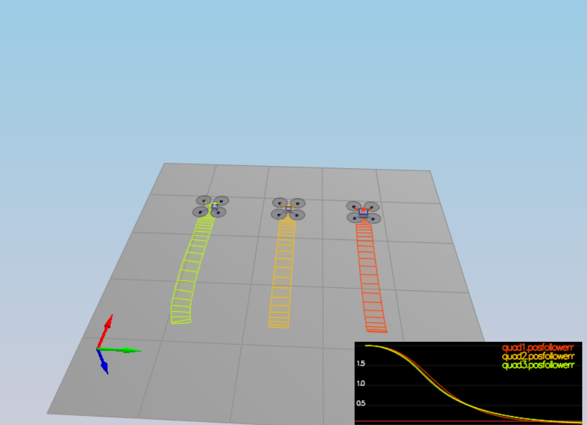
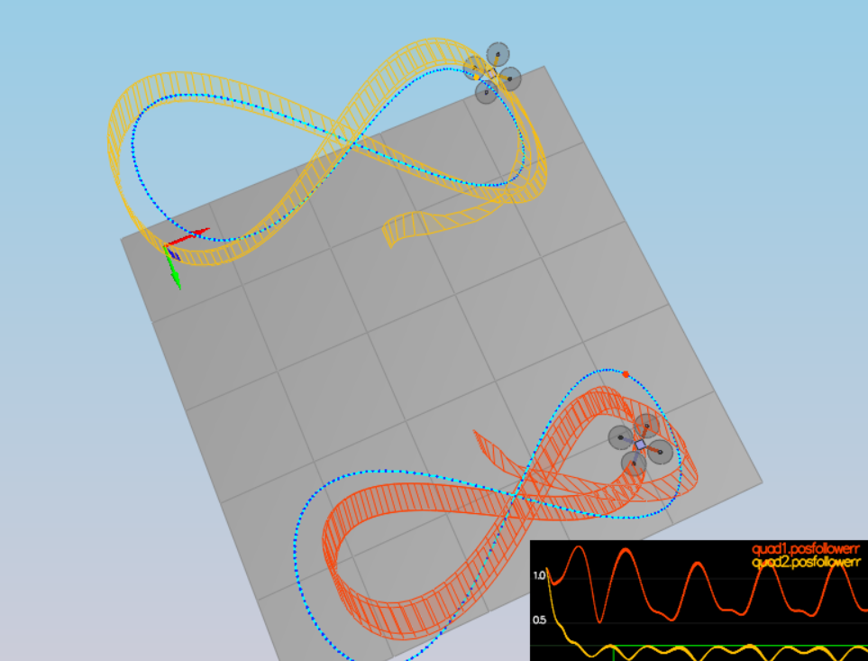

## Project: 3D Motion Planning
---

## [Rubric](https://review.udacity.com/#!/rubrics/1643/view) Points
### Here I will consider the rubric points individually and describe how I addressed each point in my implementation.  

---
### Writeup / README

#### 1. Provide a Writeup / README that includes all the rubric points and how you addressed each one.  You can submit your writeup as markdown or pdf.  

You're reading it! Below I describe how I addressed each rubric point and where in my code each point is handled.

### Implemented Controller

#### 1. Implemented body rate control in C++
It is implemented in function 'QuadControl::BodyRateControl`. I used kpPQR as proportionality coefficient for P controller on error difference between pqrCmd and pqr. 

#### 2. Implement roll pitch control in C++
It is implemented in function 'QuadControl::RollPitchControl`. I used desired collective thrust and acclerations and apply a few equations on elements of rotation matrix.

#### 3. Implement altitude controller in C++
It is implemented in function 'QuadControl::AltitudeControl`. I used PID controller with P component as difference between expected and actual altitude, D component as difference between expected and actual velocity. I component is also added as basic integral control to help with the different-mass vehicle with tuned coefficient KiPosZ.

#### 4. Implement lateral position control in C++
It is implemented in function 'QuadControl::LateralPositionControl`. Differences between expected and current positions are added with differences between current and expected velocity after multiplying with tuned proportional coefficients kpPos(kpPosXY)and kpVel(kpVelXY) respectively.

#### 5. Implement yaw control in C++
It is implemented in function 'QuadControl::YawControl`. Configuration parameter KpYaw is used and tuned for P controlling yaw.    

#### 6. Implement calculating the motor commands given commanded thrust and moments in C++
It is implemented in function `QuadControl::GenerateMotorCommands`. I used desired collective thrust and desired rotation moment about each axis to find thrust on each 4 propellers using simple linear equations.  

### Flight Evaluation
#### 1. Your C++ controller is successfully able to fly the provided test trajectory and visually passes inspection of the scenarios leading up to the test trajectory
Yes, C++ controller is successfully able to fly the provided test trajectory and visually passes all the scenarios as can ben seen in below logs and images.    

```
PASS: ABS(Quad.PosFollowErr) was less than 0.500000 for at least 0.800000 seconds
PASS: ABS(Quad.Roll) was less than 0.025000 for at least 0.750000 seconds
PASS: ABS(Quad.Omega.X) was less than 2.500000 for at least 0.750000 seconds
PASS: ABS(Quad1.Pos.X) was less than 0.100000 for at least 1.250000 seconds
PASS: ABS(Quad2.Pos.X) was less than 0.100000 for at least 1.250000 seconds
PASS: ABS(Quad2.Yaw) was less than 0.100000 for at least 1.000000 seconds
PASS: ABS(Quad2.PosFollowErr) was less than 0.250000 for at least 3.000000 seconds
```



