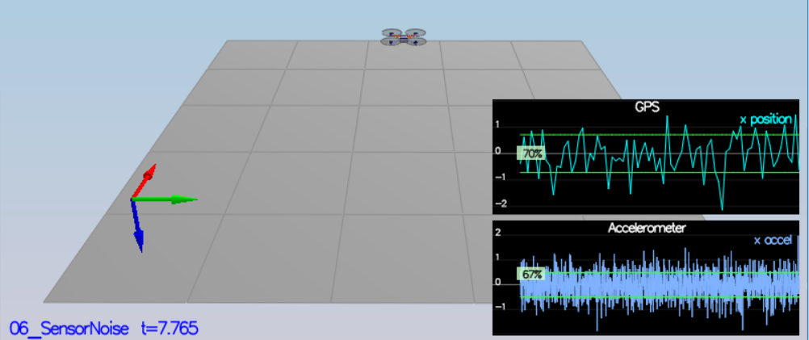
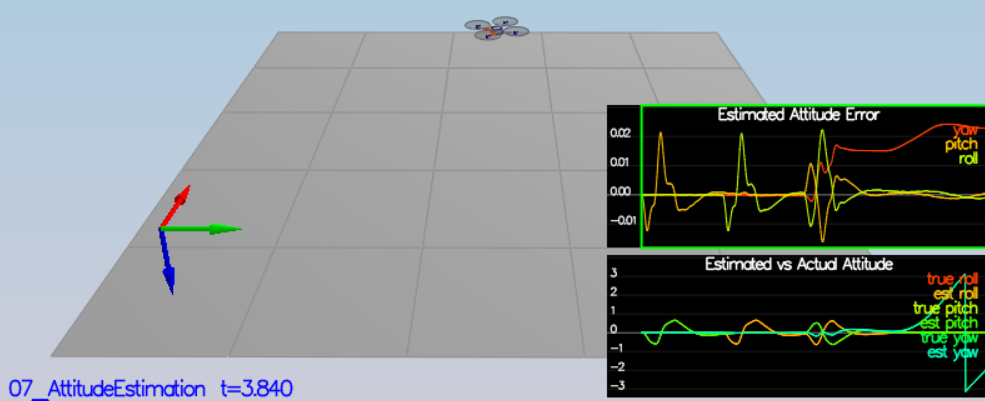
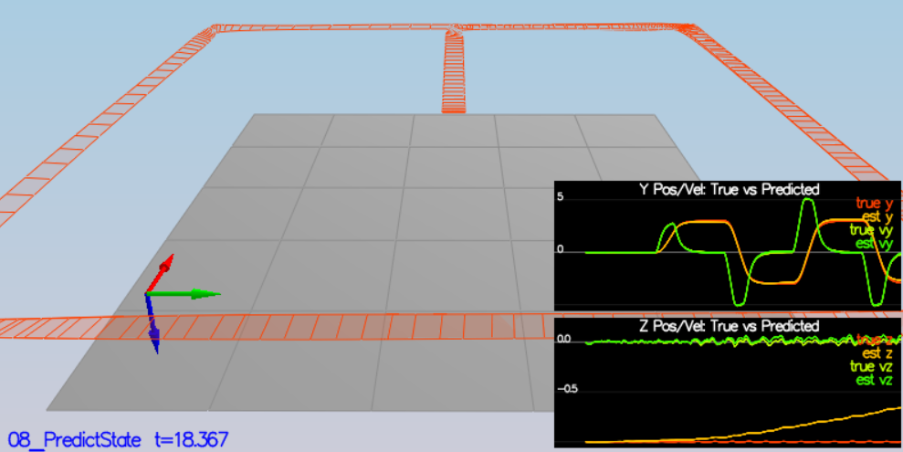
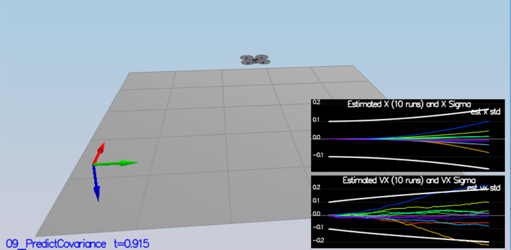
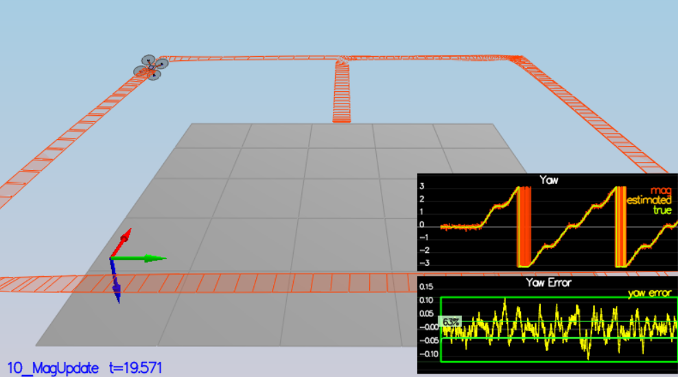
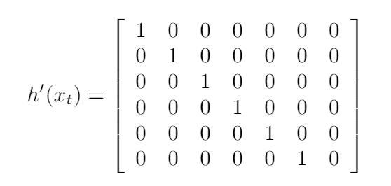
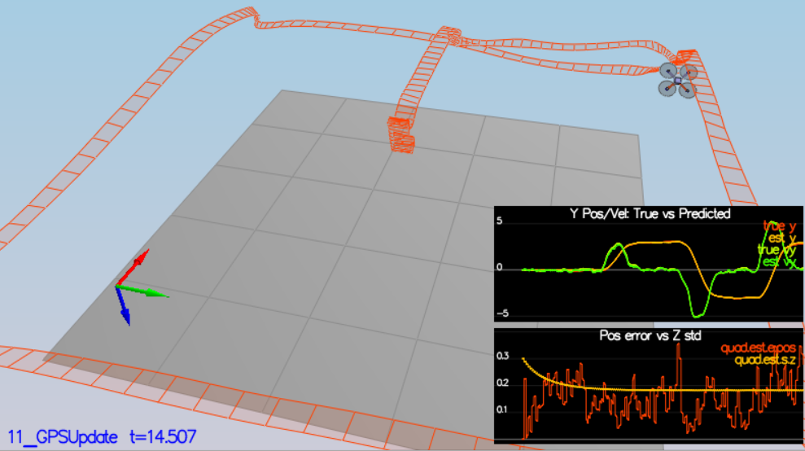

## Project: Building an Estimator 
---

## [Rubric](https://review.udacity.com/#!/rubrics/1807/view) Points
### Here I will consider the rubric points individually and describe how I addressed each point in my implementation.  

---
### Writeup / README

#### 1. Provide a Writeup / README that includes all the rubric points and how you addressed each one.  You can submit your writeup as markdown or pdf.  

You're reading it! Below I describe how I addressed each rubric point and where in my code each point is handled.

### Implement Estimator
#### Determine the standard deviation of the measurement noise of both GPS X data and Accelerometer X data.

After choosing scenario 06_NoisySensors in simulation, we record sensor data on a static quad and take logs for GPS X position and accelerometer's x measurement. We take standard deviation from logs through below code in python.   
```
df = pd.read_csv('F:/FCND/P4/FCND-Estimation-CPP/config/log/Graph1.txt')
df[' Quad.GPS.X'].std()
```

```
df = pd.read_csv('F:/FCND/P4/FCND-Estimation-CPP/config/log/Graph2.txt')
df[' Quad.IMU.AX'].std()
```

We put following numbers in `06_SensorNoise.txt` as std values found above
```
MeasuredStdDev_GPSPosXY = 0.7146
MeasuredStdDev_AccelXY = 0.4895 
```

With these values, Simulator pass the required scenario as in below logs and image.
```
Simulation #4 (../config/06_SensorNoise.txt)
PASS: ABS(Quad.GPS.X-Quad.Pos.X) was less than MeasuredStdDev_GPSPosXY for 71% of the time
PASS: ABS(Quad.IMU.AX-0.000000) was less than MeasuredStdDev_AccelXY for 68% of the time
```



#### Implement a better rate gyro attitude integration scheme in the UpdateFromIMU() function.

We implemented a better rate gyro attitude integration scheme containing already implemented complementary type attitude filter.

```
Simulation #9 (../config/07_AttitudeEstimation.txt)
PASS: ABS(Quad.Est.E.MaxEuler) was less than 0.100000 for at least 3.000000 seconds
```



#### Implement all of the elements of the prediction step for the estimator.
In QuadEstimatorEKF.cpp, we calculated the partial derivative of the body-to-global rotation matrix in the function GetRbgPrime(). We implemented the rest of the prediction step (predict the state covariance forward) in Predict(). After implementation, we have scenario passing as in below screenshot of simulator.




#### Implement the magnetometer update.
After updating magnetometer in function `UpdateFromMag`, we are able to pass yaw related scenario. 

```
Simulation #62 (../config/10_MagUpdate.txt)
PASS: ABS(Quad.Est.E.Yaw) was less than 0.120000 for at least 10.000000 seconds
PASS: ABS(Quad.Est.E.Yaw-0.000000) was less than Quad.Est.S.Yaw for 64% of the time
```



#### Implement the GPS update.
After integrating following update equation for GPS, we were able to successfully update and pass the scenario as shown in simulator logs and image


Following logs are logs after updating GPS
```
Simulation #82 (../config/11_GPSUpdate.txt)
PASS: ABS(Quad.Est.E.Pos) was less than 1.000000 for at least 20.000000 seconds
```



# Flight Evaluation
## Meet the performance criteria of each step.
All simulations are able to complete and drone is able to stay on its position or complete the flight plan.

## De-tune your controller to successfully fly the final desired box trajectory with your estimator and realistic sensors.
The controller developed in the previous project is de-tuned to successfully meet the performance criteria of the final scenario (<1m error for entire box flight).
